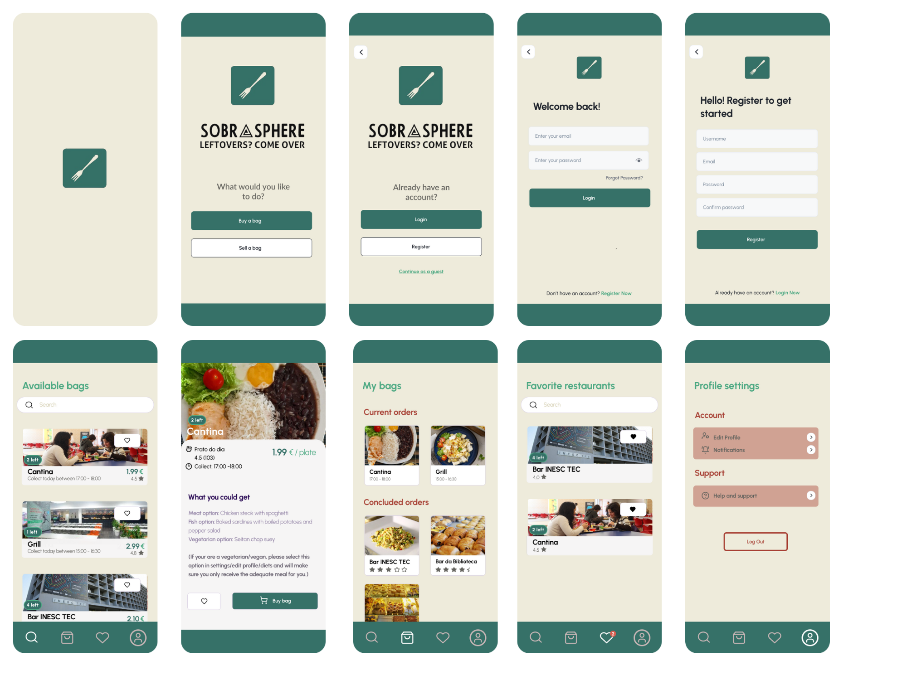

# _SOBRA SPHERE_ App Design

Design made with Figma for an app that works similarly to ToGoodToGo but for academic establishments.The app is a bridge between U.Porto's eateries and its community, transforming surplus into savings and pioneering a sustainable, zero-waste dining culture on campus.

## Features 

- Are you a customer or establishment staff? - Before accessing any feature of the app, the user will have to identify if it's a customer(students, professors, staff) or if it intends to sell food in the app.
- Login or create an account- First-time users must create an account to access the app.
- Recover password
- Edit profile
- Favorite restaurants - List of the user's favorite places to eat on campus (create an option to get notifications when the restaurant realizes "bags")
- Secure payment
- My orders - Orders already purchased which are waiting to be picked up.
- Available "bags of food" at the moment
- Search for restaurants
- Create food bag sales - only available to establishment staff accounts
- Customer support
- Rate a restaurant
- Information about sales - only available to establishment staff accounts
- 
## MockUps

  

